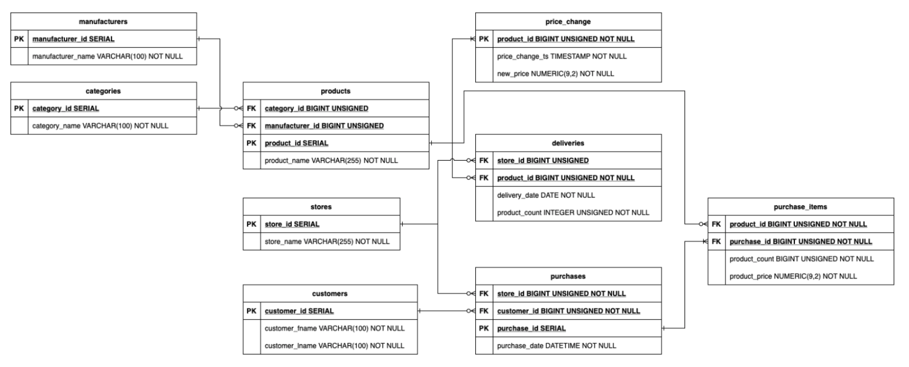

# Домашнее задание №1

### Для запуска необходимо:
1. Склонировать репозиторий: `git clone git@github.com:Khabirzyanova/ftda_dwh_course_2023.git`
2. Перейти в папку hw01: `cd ftda_dwh_course_2023/hw01`
3. Для запуска контейнеров воспользоваться `docker-compose up`

### Описание файлов:
 Файл createdb.sql содержкоторый соответствует структуре, представленной ниже:
 

