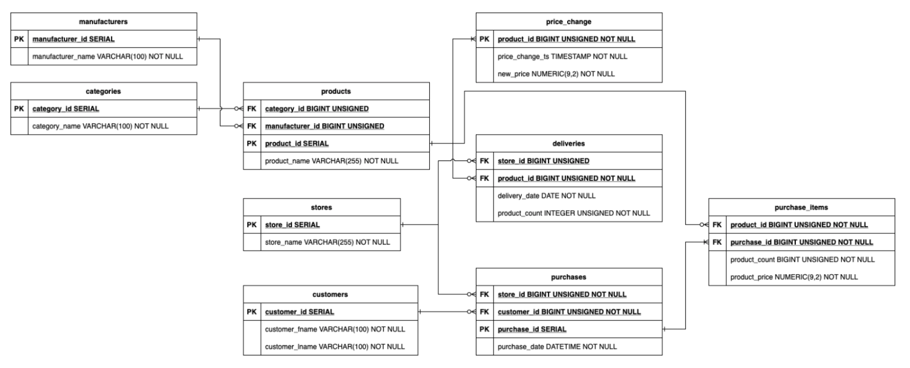

# Домашнее задание №1

### Для запуска необходимо:
1. Склонировать репозиторий: `git clone git@github.com:Khabirzyanova/ftda_dwh_course_2023.git`
2. Перейти в папку hw01: `cd ftda_dwh_course_2023/hw01`
3. Для запуска контейнеров воспользоваться `sh docker-init.sh`

### Описание файлов:
- createdb.sql содержит описание базы данных, которое соответствует структуре, представленной ниже (но в таблице **price_change** нет primary key) и view для GMV:
 
 
- init-data - файл с данными для таблиц в базе данных
- docke-compose.yml - файл для запуска docker контейнера
 

