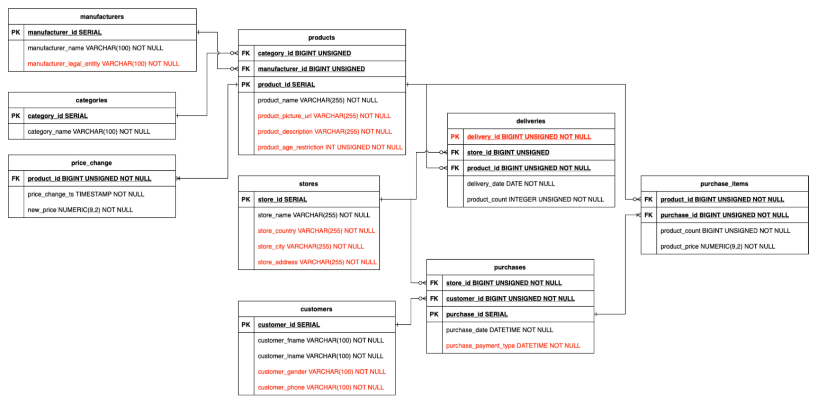

# Домашнее задание №2

Работа, использовавшаяся для вдохновения: https://github.com/kzzzr/data-vault-etl

1. В папке hw02 содержатся такие же файлы, как и в папке hw01 за исключением csv-файлов с данными для таблиц в базе данных.
2. Добавлены новые поля в файл createdb.sql для того, чтобы база данных соответсвовала схеме ниже:

3. Для реализации детального слоя DWH была выбрана архитектура Data Vault 2.0, потому что:
    - эта модель данных, спроектированная специально для удовлетворения потребностей хранилищ данных предприятия;
    - PIT (point in time) упрощает получение информации из Сателлитов одной сущности с разной частотой обновления;
    - Мост (Bridge) упрощает соединение данных через несколько связей.
4. 
5. 
